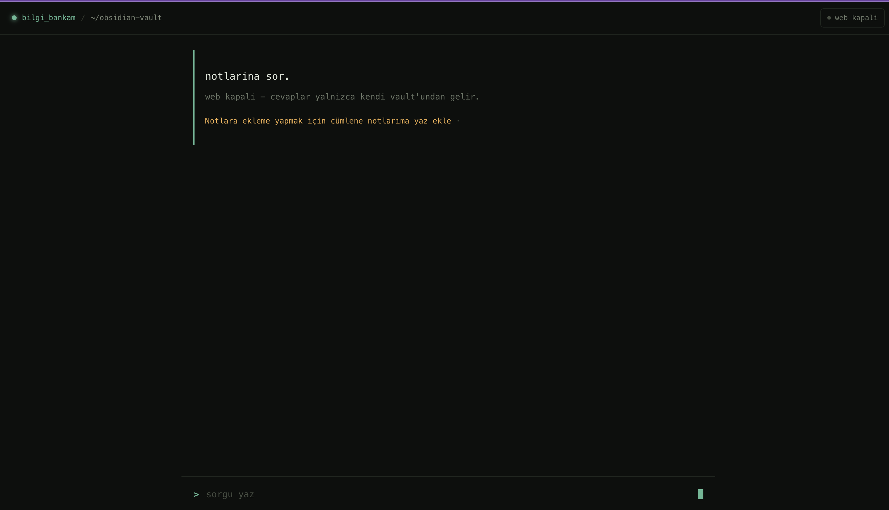

# Note Assistant 🧠

A personal AI assistant that lets you talk to your own Obsidian notes. Ask questions in natural language and get answers grounded in what you've written; optionally search the web, and create new notes on command.

Unlike a generic chatbot, its knowledge comes from **your own vault** — a private, self-hosted "second brain."

---


## Features

- **Answers from your notes** — Reads every `.md` file in your Obsidian vault and answers strictly from your own content, without fabricating information.
- **Toggleable web search** — Turn web access on or off with a single switch. When off, answers come only from your notes; when on, the agent can also draw on current, external information.
- **Note creation** — Say "take a note" and it writes a new `.md` file into your vault.
- **Conversational memory** — Handles follow-up questions ("what about the first one?") by remembering the prior exchange.
- **Semantic search** — Retrieves by meaning rather than keyword matching, so it finds the relevant note even when phrased differently.

---

## Architecture

The system has two parts:

**Backend (Python / FastAPI)**
- Reads Obsidian notes, splits them into chunks, and embeds them using the multilingual **BGE-M3** model.
- Stores vectors in **Chroma** (persisted to disk, so notes aren't re-embedded on every start).
- A **LangGraph agent** decides which tool to use for each query — note search, web search, or note writing.
- Answers are generated by a large language model served via **Cerebras**.

**Frontend (Next.js / TypeScript)**
- A minimal, terminal-inspired query interface.
- Sends requests to the backend and manages the web-search toggle.

```
User → Next.js UI → FastAPI backend → LangGraph agent
                                          ├── search notes (Chroma + BGE-M3)
                                          ├── search web (Tavily)
                                          └── write note (.md)
```

---

## Tech Stack

| Layer | Technology |
|-------|-----------|
| LLM | Cerebras (gpt-oss-120b) |
| Embeddings | BGE-M3 (multilingual) |
| Vector store | Chroma |
| Agent / orchestration | LangChain + LangGraph |
| Web search | Tavily |
| Backend | FastAPI |
| Frontend | Next.js, TypeScript |

---

## Getting Started

### Prerequisites
- Python 3.9+
- Node.js 18+
- An Obsidian vault (or any folder of `.md` files)
- API keys: [Cerebras](https://cloud.cerebras.ai) and [Tavily](https://tavily.com) (both offer free tiers)

### 1. Clone
```bash
git clone https://github.com/[YOUR-USERNAME]/note-assistant.git
cd note-assistant
```

### 2. Backend
```bash
cd backend
python3 -m venv .venv
source .venv/bin/activate          # Windows: .venv\Scripts\activate
pip install -r requirements.txt
```

Create a `.env` file in the backend directory:
```
CEREBRAS_API_KEY=your_key
TAVILY_API_KEY=your_key
```

Update the vault path in the code to point to your notes:
```python
VAULT_YOLU = "/path/to/your/obsidian/vault"
```

### 3. Frontend
```bash
cd ../frontend
npm install
```

### 4. Run
```bash
# backend (in one terminal)
cd backend && source .venv/bin/activate && uvicorn api:app

# frontend (in another terminal)
cd frontend && npm run dev
```

Open `http://localhost:3000` (or your configured port) in the browser.

> A `basla.sh` script in the project root starts both with a single command.

---

## Usage

- **Query your notes:** "which classes do I have on Friday?"
- **Get external info** (web on): "what's the weather today?"
- **Create a note:** "take a note: dentist appointment tomorrow at 3pm"
- **Follow up:** "what time is the first one?"

---

## Notes & Limitations

- This is a **single-user, local** tool — notes stay on your machine, and it is not designed as a multi-tenant service.
- Answers are grounded in the notes; for topics not covered (with web search off), the assistant replies that the information isn't in your notes.
- The embedding model (BGE-M3) downloads on first run (~2 GB) and runs locally.

---

<details>
<summary>🇹🇷 Türkçe</summary>

<br>

# Not Asistanı 🧠

Kendi Obsidian notlarınla konuşabildiğin kişisel bir yapay zeka asistanı. Doğal dille soru sorarsın, cevabı yazdıklarına dayanarak verir; istersen web'e de bakar ve komutla yeni not oluşturabilir.

Sıradan bir sohbet botu değil — bilgisi **senin kendi vault'undan** gelen, özel, kendi sunucunda çalışan bir "ikinci beyin."


## Özellikler

- **Notlarından cevaplar** — Vault'undaki tüm `.md` dosyalarını okur, yalnızca senin içeriğine dayanarak, uydurmadan yanıtlar.
- **Açılıp kapanabilen web araması** — Tek tuşla web erişimini açıp kapatırsın. Kapalıyken sadece notlarından, açıkken güncel/dış bilgiden de yararlanır.
- **Not oluşturma** — "not al" dediğinde vault'una yeni bir `.md` dosyası yazar.
- **Sohbet hafızası** — Takip sorularını önceki konuşmayı hatırlayarak yanıtlar.
- **Anlamsal arama** — Kelime değil anlam bazlı arar; farklı ifade etsen de ilgili notu bulur.

## Mimari

**Backend (Python / FastAPI):** Notları okur, parçalara böler, **BGE-M3** ile vektörlere çevirir, **Chroma**'da saklar. Bir **LangGraph agent** her sorguda hangi aracı kullanacağına karar verir (not araması / web araması / not yazma). Cevaplar **Cerebras** üzerinden bir dil modeliyle üretilir.

**Frontend (Next.js / TypeScript):** Terminal esintili sade bir sorgu arayüzü; backend'e istek atar ve web aç/kapa durumunu yönetir.

## Kurulum

Gereksinimler: Python 3.9+, Node.js 18+, bir Obsidian vault ve [Cerebras](https://cloud.cerebras.ai) + [Tavily](https://tavily.com) API anahtarları (ücretsiz katmanları var).

Backend klasöründe sanal ortam kur, `requirements.txt`'i yükle, `.env` dosyasına anahtarlarını ekle ve kod içindeki vault yolunu kendi notlarına göre güncelle. Frontend'de `npm install` çalıştır. Proje kökündeki `basla.sh` ikisini tek komutla başlatır.

## Sınırlamalar

- **Tek kullanıcılı, yerel** bir araçtır; notlar makinede kalır, çok kullanıcılı servis olarak tasarlanmamıştır.
- Cevaplar notlara dayanır; web kapalıyken notlarda olmayan bir konuda "bu bilgi notlarında yok" der.
- BGE-M3 embedding modeli ilk çalıştırmada (~2 GB) indirilir ve yerelde çalışır.

</details>
